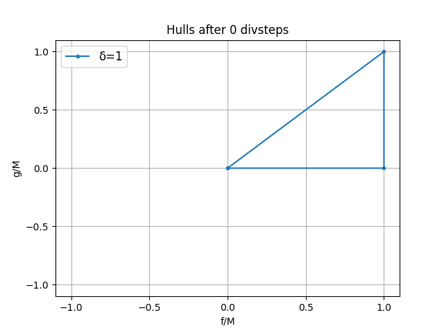
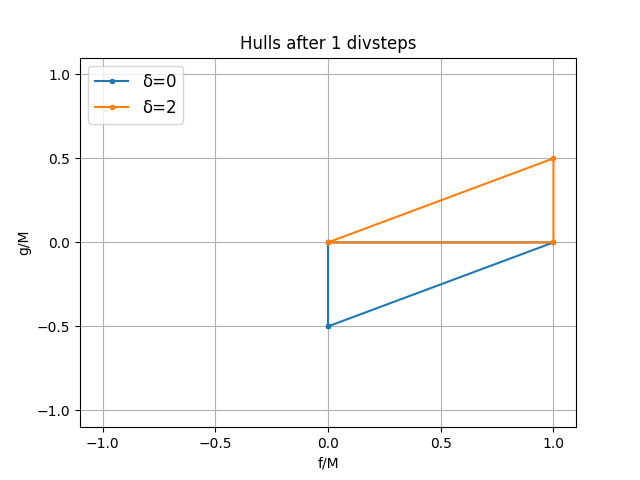
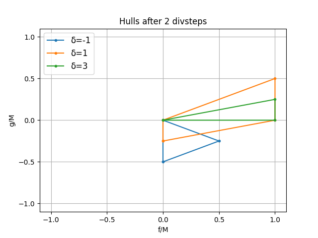
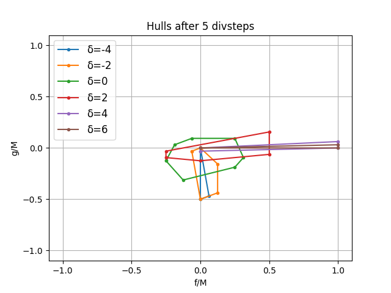
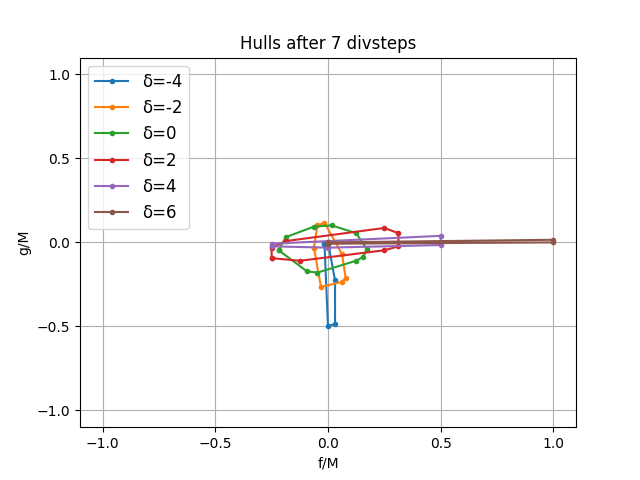
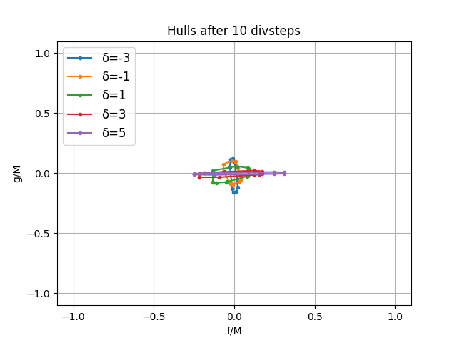
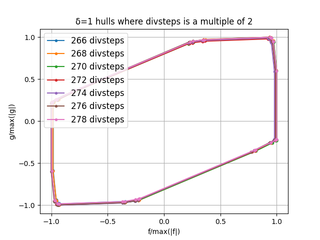
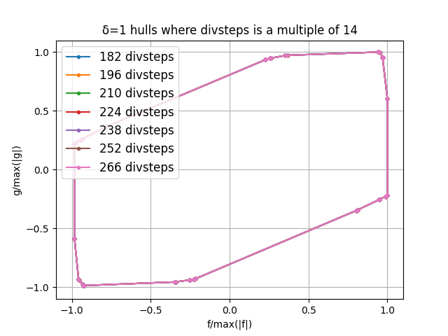
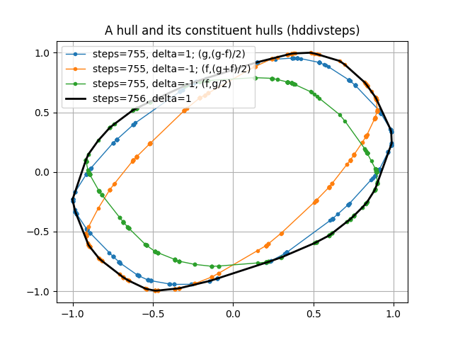
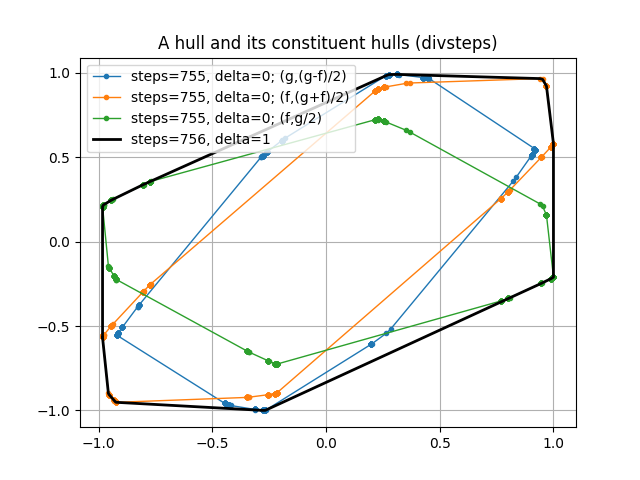

# Bounds on divsteps iterations in safegcd

In this document we explain an alternative strategy for computing upper bounds on the number of divstep iterations
needed in for the "safegcd" algorithm from the paper
["Fast constant-time gcd computation and modular inversion"](https://gcd.cr.yp.to/papers.html) by Daniel J. Bernstein and Bo-Yin Yang.

We then introduce a variant of the algorithm, and use the new strategy to show it needs fewer iterations.

## Introduction

### Divsteps

The algorithm under consideration here computes the greatest common divisor of an odd integer *f* and an integer *g*. Conceptually,
it can be written in Python as:

```python
gcd(f, g):
    delta = 1
    while g != 0:
        if delta > 0 and g & 1:
            delta, f, g = 1 - delta, g, (g - f) >> 1
        elif g & 1:
            delta, f, g = 1 + delta, f, (g + f) >> 1
        else:
            delta, f, g = 1 + delta, f, (g    ) >> 1
    return abs(f)
```

Each iteration of the inner loop is called a "divstep", rewriting a *(&delta;,f,g)* tuple into a new one. When
*g=0* is reached, *|f|* gives the GCD of the input *f* and *g*.

It has a few interesting properties:
* The first *k* steps of the algorithm are completely determined by the lowest *k* bits of *f* and *g*. This permits
  an efficient implementation, by repeating the following steps to perform *k* divsteps at once:
  * Take the low *k* bits of *f* and *g*, and determine which branches would be taken apply *k* divsteps on just those, remembering which branches were taken.
  * Compute the transformation matrix to map the input *f* and *g* to the output ones based on the taken branches. This 2x2 matrix only needs *k+2* bit elements.
  * Apply that matrix to the full numbers.
* Once *g* reaches 0, additional divsteps do not change *f* anymore.
* Individual or batched divsteps can easily be performed in constant time, which is desirable in cryptographic applications. Constant-time algorithms do not leak information about potentially secret inputs through their runtime.
  Making the entire GCD algorithm constant time however crucially depends on having a conservative upper bound *B* on the number of iterations: instead of stopping when *g=0* is reached, always perform exactly *B* steps.

### Iteration bounds

Thus, the upper bound on the number of iterations is directly proportional to the runtime of the constant-time version of the algorithm. It turns out
however that such bounds are non-trivial to derive.

Let *b = log<sub>2</sub>(f<sup>2</sup> + 4 g<sup>2</sup>)*. The paper proves that:
* If *b &leq; 42* then *&LeftFloor;19b/14&RightFloor;* iterations suffices.
* If *42 < b &leq; 92* then *&LeftFloor;(49b+46)/34&RightFloor;* iterations suffices.
* If *b > 92* then *&LeftFloor;49b/34&RightFloor;* iterations suffices.

The proof relies on defining a metric for tuples (f, g), and analyzing the rate of shrinking of this metric per divstep.

## An alternative strategy

In this document a variation on that approach is discussed. Rather than assuming a specific metric, it is possible to keep track of convex
hulls of possible (f, g) tuples after every step. This does not lead to a generally provable formula, but can be used to compute bounds
for specific numbers. Those results satsify the following formula, which we've computationally verified to hold for all
*M &leq; 2<sup>6606</sup>*:

If *M &geq; 157*, then for all *0 &leq; g &leq; f &leq; M*, the number of iterations is bounded by the *larger* of:
* *2 &LeftFloor;(2455 log<sub>2</sub>(M) + 1402) / 1736&RightFloor;*
* *2 &LeftFloor;(2455 log<sub>2</sub>(M) + 1676) / 1736&RightFloor; - 1*

Using *0 &leq; g &leq; f* is a reasonable restriction in the context of computing modular inverses. In that case *f* will be the modulus, and *g* the value
whose inverse is to be computed, and *g < f* will hold naturally.

### Approximating using convex hulls

The exact maximum number of iterations appears very difficult to compute, so we make an approximation, and try to answer the following question:
for a given number *M*, what is the smallest number *B* such that any valid succession of *B* divsteps iterations (taking *&delta;*-based restrictions
into account, but always permitting both even-*g* and odd-*g* variants) applied to any **real** numbers *0 &leq; g &leq; f &leq; M*, will reach a state with
*|g| < 1* at least once. In the actual algorithm *g* is always integral, so *|g| < 1* implies *g=0*, and the algorithm would have finished at that
point, and thus this is a correct upper bound.

To do so, maintain a convex hull of *(f, g)* combinations per possible *&delta;* value. Initially that's just the triangle with vertices *(0,0), (M,0), (M,M)*
for *&delta;=1*. Then apply divsteps to these hulls, computing the image of all hulls' vertices' under both the even-*g* and odd-*g* steps, and aggregate them
into a new hull per *&delta;*. Throw away any hull for which all vertices have *|g| < 1*. When no hulls remain you know the number of performed
divsteps is the answer. Because all transformations are linear, approximating the space using convex hulls doesn't change the answer - all points
in a set reach *|g| < 1* iff all vertices of its convex hull do. Surprisingly, the number of vertices on these convex hulls seems to only grow
linearly with the number of divsteps, which makes this approach tractable.

 

 

 

The diagrams above show the hulls afters 0, 1, 2, 5, 7, and 10 divsteps. Only *-4 &leq; &delta; &leq; 6* is shown. Note that in general the hulls shrink with increasing divsteps, and the *&delta;* value is correlated with
how pointed the corresponding hull is in the *f* (for *&delta; > 0*) or *g* (for *&delta; < 0*) direction.

### Thresholds

In fact, a similar approach can be used to solve the reverse problem: given *B* iterations, what is the maximal *M*? Start with the triangle
with vertices *(0,0), (1,0), (1,1)* instead, and never throw away any hull, but instead remember how small *|g|* is guaranteed to have gone
for each, either in the hull itself, or in all of the hulls representing states in its history (whichever is smaller). After every iteration,
the inverse of the largest of all these numbers gives how much larger the initial triangle could have been to guarantee a *|g| < 1* was reached,
giving the highest *M* for that many iterations. An implementation of this algorithm can be found using Python code in [hull_bound.py](hull_bound.py). In about 22
CPU hours it finds all thresholds for *B* up to 3600 (using exact integer arithmetic). A more performant C++ version that produces the same output can be found in
[hull_bound.cpp](hull_bound.cpp). We've run this for up to *B=18684* (for which *M &geq; 2<sup>6606</sup>*); the output is in [output.txt](output.txt).

For sufficiently large values (*M &geq; 2<sup>183</sup>*), the relation between *M* and *B* at these thresholds seems to be
very accurately described by *log<sub>2</sub>(M) = B / 2.828339632 + offset[B mod 14]*, where
*offset = [0.02824363620, -0.2130205325, 0.03790228200, -0.2155010405, 0.03189270185, -0.2071202326, 0.02469215121, -0.2085565404, 0.03307295910, -0.2174845246, 0.03635669395, -0.2119495555, 0.02742870975, -0.2040925483]*.
The formula given above is an approximation inspired by the relation above, taking into account that *offset[i]* seems to alternate between two clusters of numbers, one for even and one for odd iteration counts.
The code for deriving it from [output.txt](output.txt), as well as verifying it with exact integer arithmetic, is in [derive_formula.py](derive_formula.py).

This relation bears an interesting resemblance to the findings in section F.1 of the paper. There, the authors look at the spectral radius (maximum of absolute eigenvalues) of
divsteps transformation matrices as a preliminary analysis to determine how fast *f* and *g* shrink. It shows how sequences of 14 divsteps (beginning and ending with *&delta; = 1*) exist
such that the spectral radius of the their combined transformation matrix is *(561 + &Sqrt;249185) / 2<sup>15</sup> = 1 / 2<sup>4.949900586...</sup>*. This implies
that (repetitions) of such 14-divstep sequences only shrink some inputs by a factor *1 / 2<sup>4.949900586.../14</sup> = 1 / 2<sup>1/2.828339632...</sup>* per divstep, and
for such inputs thus *2.828339632...* steps are needed per input bit. It is not known whether that's the largest *N*th root of the spectral radius for *N* successive divsteps,
but the fact that the exact same factor appears here experimentally, as well as the apparent 14-cycle of the threshold offsets, is an indication that it may be - at least up to several thousand divsteps.

 

Another interesting observation is that these hulls seem to converge to a common shape. This is somewhat the case in general, as can be seen
in the first picture above. It is much more the case when only looking at hulls that are 14 divsteps apart, as seen in the second picture above.
Only *&delta; = 1* is pictured, but the same pattern exists for other *&delta;* values.

## A faster variant of divsteps: hddivsteps

Armed with the analysis technique explained above, it is now easy to see if variants exist with better bounds. It turns out that indeed, those exist,
and this variant appears particularly good:

```python
gcd(f, g):
    delta = 1
    while g != 0:
        if delta > 0 and g & 1:
            delta, f, g = 2 - delta, g, (g - f) >> 1
        elif g & 1:
            delta, f, g = 2 + delta, f, (g + f) >> 1
        else:
            delta, f, g = 2 + delta, f, (g    ) >> 1
    return abs(f)
```

where the first branch updates *&delta;* to *2 - &delta;* and *2 + &delta;* instead of *1 - &delta;* and *1 + &delta;*. This is equivalent to the
original algorithm, but starting with *&delta; = 1/2* instead of *&delta; = 1*. We'll call this variant "hddivsteps", where hd stands for
"half delta".

It appears to need approximately 20% fewer iterations. The following formula has been verified for all *M &leq; 2<sup>3805</sup>*:

* If *M &geq; 4257874*, then for all *0 &leq; g &leq; f &leq; M*, the number of hddivsteps iterations is bounded by *&LeftFloor;(3787 log<sub>2</sub>(M) + 2166) / 1644&RightFloor;*.

### Analysis

Both [hull_bound.py](hull_bound.py) (with the `--half-delta` option) and [hull_bound.cpp](hull_bound.cpp) (compiled with `-DHALF_DELTA`) support analysing this variant.
The output can be found in [half_delta_output.txt](half_delta_output.txt). Similar to the original construction, the relation between *M* and *B* at the thresholds
now seems to be accurately described as *log<sub>2</sub>(M) = B / 2.3035275222 + offset[B mod 54]*. Also similarly, a valid sequence of now 54 steps
exists whose combined transformation matrix has spectral radius *(3&Sqrt;273548757304312537 + 1591853137) / 2<sup>55</sup>*, exactly corresponding to the ratio
*2.3035275222...*.

### Hulls

The diagrams below show the *&delta; = 1* hull after 756 iterations, both under hddivsteps and divsteps. They also show the three "parent" hulls they are derived from:
specific hulls after 755 iterations, transformed using the 3 branches in the loop. The hddivsteps variant has hulls that overlap much more, meaning the resulting
hull introduces less expansion. Only one steps and delta value is shown here, but this principle applies for all.

 
